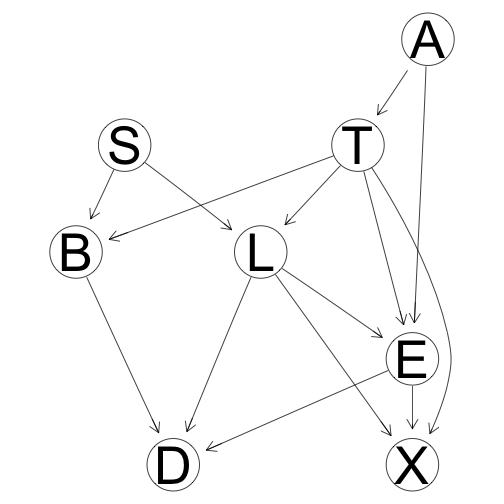
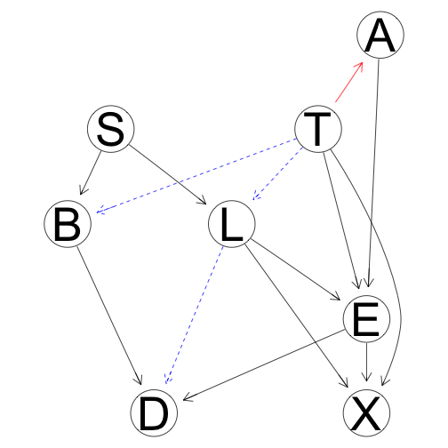
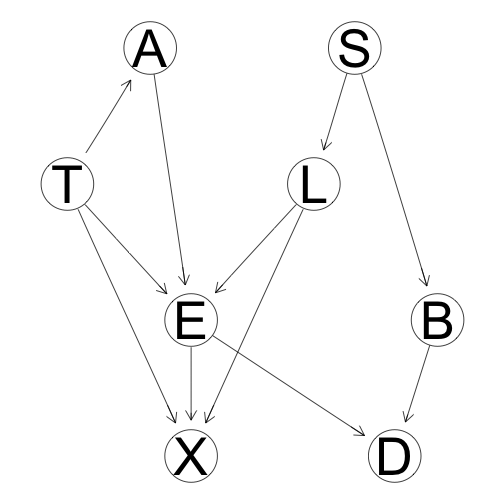
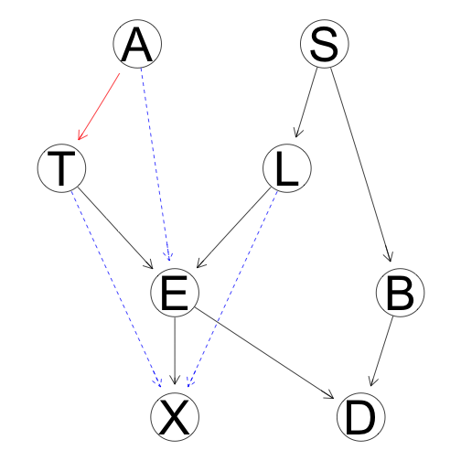
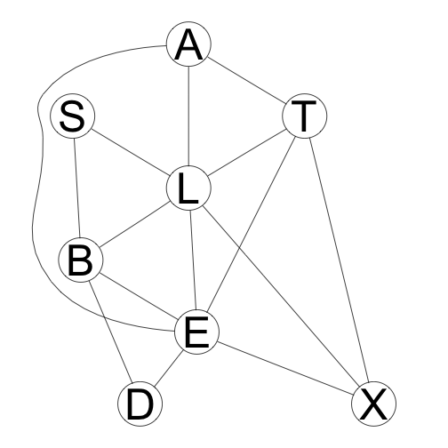
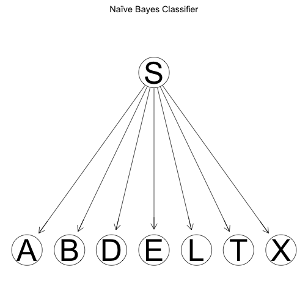

## Lab 1 - Graphical Models

The first lab is about **Graphical Models** and brings up concepts such as

- Equality between graphs by determining if they have the same adjacencies and unshielded colliders
- Markov blankets and independences
- Naïve Bayes classifiers 

And an overall discussion about what influences predictions in Bayesian Networks and Markov Models.

### Inequality between graphs

What is concluded from the below graphs is that the misclassification rates for the different Bayesian Networks is the same as long as the markov blanket is the same. For the Naïve Bayes classifier, the trade off between model complexity and model efficiency hurts the predictions a bit. 

  

Comparison between DAGs generated by HC for different restarts and iss=15

  
  

Comparison between DAG generated by hc and the true DAG

  
  

The junction tree created from the DAG through the junction tree algorithm. The junction tree algorithm turns the graph into a tree of clusters where each cluster is connected to a factor from the VE process.

  
  

The Naïve Bayes classifier DAG. Assuming conditional independence of all other attributes given S.

  
  
