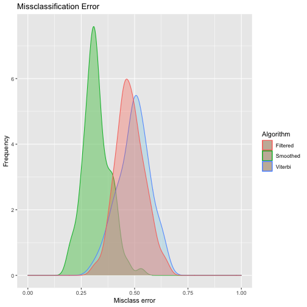

# Advance-Machine-Learning-TDDE15


## Lab 1 - Graphical Models

The first lab is about **Graphical Models** and brings up concepts such as

- Equality between graphs by determining if they have the same adjacencies and unshielded colliders
- Markov blankets and independences
- Naïve Bayes classifiers 

And an overall discussion about what influences predictions in Bayesian Networks and Markov Models.


### Inequality between graphs

What is concluded from the below graphs is that the misclassification rates for the different Bayesian Networks is the same as long as the markov blanket is the same. For the Naïve Bayes classifier, the trade off between model complexity and model efficiency hurts the predictions a bit. 

<br> 

Comparison between DAGs generated by HC for different restarts and iss=15


<br> 
<br> 

Comparison between DAG generated by hc and the true DAG


<br> 
<br> 

The junction tree created from the DAG through the junction tree algorithm. The junction tree algorithm turns the graph into a tree of clusters where each cluster is connected to a factor from the VE process.


<br> 
<br> 

The Naïve Bayes classifier DAG. Assuming conditional independence of all other attributes given S.


<br> 
<br> 

## Lab 2 - Hidden Markov Models

### Lab introduction {-}

Build a hidden Markov model (HMM) for a scenario when we have a robot that walks around a ring. The ring is divided into 10 sectors. The robot is equipped with a tracking device that you can access. The device is not very accurate though: If the robot is in the sector i, then the device will report that the robot is in the sectors [i − 2, i + 2] with equal probability. At any given time point, the robot is in one of the sectors and decides with equal probability to stay in that sector or move to the next sector. You do not have direct observation of the robot.

The hidden markov model (HMM) was constructed by using the HMM library together with settings:

- States to S: 0-9,
- Observations to S: 0-9, 
- Equal starting probability for all the states, i.e 0.1, 
- A transition matrix corresponding to that the robot might move one state or forward or stay in the current state with equal probability,
- An emission matrix corresponding to where the signal might come from given the true state. If the robot is in state i, the signal might come from state [i-2, i+2] with equal probability (0.2).

The HMM model was then initialized with the initHMM function where the arguments were applied. 

The HMM model was simulated for a 100 time steps. This was done a 100 times in order to get good estimates of the different algorithms: 
 
- filtered 
- smoothed 
- viterbi

From the values obtained by the simulation, the observations were used, but the hidden states were discarded from future calculations. 

The forward and backward algorithms are used in order to obtain alpha and beta, which in their turn are used in order to calculate the filtered and smoothed probability distributions. 


### Results {-}

To measure the accuracy of predictions from the algorithms, the misclassification rate was used. By simulating the hidden markov model a hundred times, good estimates of the accuracy of the algorithms was obtained. 

The predictions made by the filtered and smoothing algorithms were calculated by taking the state with the highest probability in each time step.

To give an illustration, the confusion matrices for the different algorithms given one simulation of the hidden markov model is shown below. 


### Comparison of algorithms {-}

To gain further insight into the performance of the algorithms, the misclassification rate for each of the algorithms was calculated and averaged over 100 simulations. The results are shown in the graph below. 



### In general, the smoothed distributions should be more accurate than the filtered distributions and the most probable paths. Why? {-}

The smoothing distribution indeed seems to be more accurate than the filtered distribution and the most probable path. This is due to the fact that the smoothing distribution uses all the observations from time steps 1-100 for both the forward and backward algorithms in order to predict with what probability the robot was in state x at time t. In comparison, the filtered algorithm only takes into consideration all the observations up until the given time.


### Shannon entropy {-}


As can be seen from the plot, the entropy decreases during the first 4 time steps but stagnates thereafter and only fluctuates. The interpretation of this is that we become more sure of the location of the robot during the first 4 time steps but that we gain no further knowledge after that. The Shannon entropy fluctuates a lot which is due to the fact that depending on what state the emission signals in subsequent time steps are. 

### Probability of the robot being in a hidden state at time 101 {-}

Compute the probabilities of the hidden states for the time step 101.

In order to compute the probabilities of the hidden states for the following time steps, the probabilities of the observations in the current time steps must be multiplied with the transition matrix. This means that $p(SX_{t}) = p(S(X-1)_{t-1}) *0.5 + p(SX_{t-1})*0.5$.

In our case, the probability of the robot being in a hidden state at time t (100) is


```
##  [1] 0.000 0.000 0.091 0.318 0.409 0.182 0.000 0.000 0.000 0.000
```

The transition matrix then gives us the probability of the robot being in a certain state at time t+1 (101)


```
##  [1] 0.000 0.000 0.045 0.205 0.364 0.295 0.091 0.000 0.000 0.000
```
